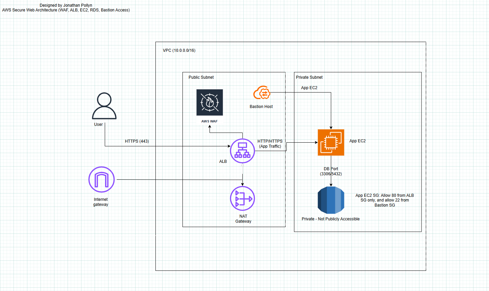

# Secure Application Deployment on AWS using Terraform
## Overview
This project shows how to turn an insecure, publicly available e-commerce app into a secure, production-ready setup on AWS using Terraform. The solution follows AWS security best practices, including network isolation, least-privileged access, encryption, and controlled access via an Application Load Balancer.

In the original setup, application servers were placed in public subnets and had open access to core services. This new approach fixes those risks by adding layered security controls and private networking.

## Role: 
AWS Solutions Architect / Cloud Engineer
## Responsibility
- Assess a vulnerable cloud architecture and identify security gaps
- Design and implement a secure, scalable AWS infrastructure
- Apply defense-in-depth using network, identity, and encryption controls
- Codify the solution using Terraform for repeatability and auditability practices

## Problemn Statement
Jnnix is a fast-growing e-commerce platform that prioritized rapid delivery over security during its initial launch. Core infrastructure components such as EC2 instances, S3 buckets, and the database layer were publicly accessible, increasing the risk of unauthorized access, data breaches, and regulatory non-compliance. 

As the platform scales and handles more customer data, a secure cloud architecture is required to protect sensitive resources while maintaining availability and performance.

## Disclaimer
Jnnix is a fictional e-commerce company created solely for the purpose of demonstrating cloud architecture design and Terraform-based infrastructure implementation. No real customer data, systems, or organizations are involved in this project.

## Objectives
- Design a secure VPC with clear network boundaries
- Separate public and private application tiers using subnet isolation
- Restrict access using security groups and least-privilege IAM principles
- Encrypt data at rest and in transit
- Expose the application safely using an Application Load Balancer
- Ensure infrastructure is reproducible using Terraform

## Architecture Overview
# Key design decisions:
- Public subnets host only internet-facing resources
- Application servers run in private subnets with no public IPs
- Database instances are isolated in private subnets
- Outbound internet access for private resources is provided via NAT Gateway
- Traffic enters the environment only through the ALB

## Architecture Diagram


## AWS Services Used
- Amazon VPC
    Network isolation using public and private subnets across multiple AZs
- Amazon EC2 (Auto Scaling Group)
    pplication tier deployed in private subnets for high availability
- Application Load Balancer (ALB)
    Secure entry point for HTTP traffic with health checks and routing
- Amazon RDS (PostgreSQL)
    Encrypted database deployed in private subnets, not publicly accessible
- Amazon S3
    Secure object storage with blocked public access and enforced encryption
- AWS IAM
    Role-based access control following the principle of least privilege
- NAT Gateway & Internet Gateway
    Controlled inbound and outbound internet connectivity

## Terraform Project Structure
```
terraform/
├── provider.tf              # AWS provider configuration
├── variables.tf             # Input variable definitions
├── terraform.tfvars         # Environment-specific values
├── locals.tf                # Naming conventions and common tags
├── vpc.tf                   # VPC, subnets, IGW, NAT, routing
├── security_groups.tf       # Network access controls
├── alb.tf                   # ALB, listeners, target groups
├── compute.tf               # Launch template and Auto Scaling Group
├── rds.tf                   # RDS instance and subnet group
├── s3.tf                    # Secure S3 bucket and policies
├── outputs.tf               # Useful deployment outputs
├── images/                  # Architecture diagrams and screenshots
└── README.md
```
## Deployment Instructions
```
terraform init
terraform plan
terraform apply
```


## Deployment Validation
ALB showing healthy targets

EC2 instances running in private subnets

RDS instance not publicly accessible


## Security Highlights
- Add AWS WAF for Layer 7 protection
- Enforce HTTPS with ACM certificates
- Introduce centralized logging with CloudWatch
- Implement CI/CD for Terraform deployments